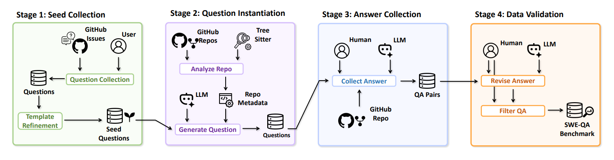
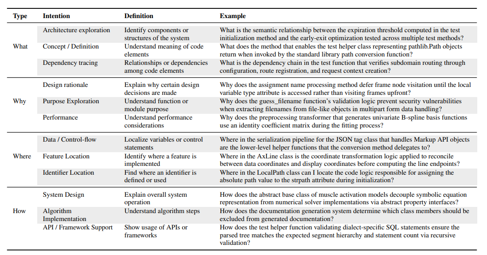

# SWE-QA

**SWE-QA** is a benchmark for **repository-level code question answering**. This repository hosts the benchmark **data** (question–answer pairs tied to pinned commits) and **code** to construct the benchmark, clone evaluation repositories, and run baselines and agents.

It covers the original **SWE-QA v1** release (12 popular Python projects such as `Django` and `Flask`) together with the complementary **SWE-QA v2** that adds `conan`, `streamlink`, and `reflex`.

👏Our paper "SWE-QA: Can Language Models Answer Repository-level Code Questions?" has been accepted to **ACL 2026 Findings**.

If you use SWE-QA in your work, please cite:

```bibtex
@article{peng2025swe,
  title={Swe-qa: Can language models answer repository-level code questions?},
  author={Peng, Weihan and Shi, Yuling and Wang, Yuhang and Zhang, Xinyun and Shen, Beijun and Gu, Xiaodong},
  journal={arXiv preprint arXiv:2509.14635},
  year={2025}
}
```

## 📖 Paper

For more details about the methodology and results, please refer to the paper:
- **Paper**: "SWE-QA: Can Language Models Answer Repository-level Code Questions?"【[arxiv](https://arxiv.org/abs/2509.14635)】

## 📊 Dataset

The benchmark dataset is available on Hugging Face:
- **Dataset**: 【[hugging-face](https://huggingface.co/datasets/swe-qa/SWE-QA-Benchmark)】

### Benchmark Construction Workflow

The following diagram illustrates the workflow for constructing the SWE-QA benchmark:



### Benchmark Example

The following example shows the structure and format of questions in the benchmark:




## 📁 Repository Structure

```
SWE-QA-Bench/                    # Repository root
├── Benchmark/                 # Released benchmark (JSONL per project)
│   ├── *.jsonl                # e.g. astropy.jsonl, django.jsonl, ...
├── Benchmark construction/    # Build and score the benchmark
│   ├── issue_analyzer/        # GitHub issue to question drafts
│   ├── qa_generator/
│   ├── repo_parser/
│   ├── score/                 # e.g. llm-as-a-judge.py
│   └── models/
├── Experiment/
│   ├── ErrorAnalysis/         # e.g. error_analysis.jsonl
│   └── Script/                # Eval methods and agent runners
│       ├── llm_direct/
│       ├── rag_function_chunk/
│       ├── rag_sliding_window/
│       ├── SWE-agent_QA/
│       ├── OpenHands_QA/
│       └── Cursor-Agent_QA/
├── assets/                    # README figures
├── clone_repos.sh
├── repo_commit.txt            # URLs + commits for clone_repos.sh
├── pyproject.toml             # Dependencies (uv)
├── uv.lock
├── Dockerfile
├── LICENSE
└── README.md
```

After running `./clone_repos.sh`, evaluated repositories are checked out under `datas/repos/` (not committed to git).


## 🚀 Environment Setup

### Prerequisites

- Python 3.12
- uv package management
- OpenAI API access (required for all evaluation methods)
- Voyage AI API access (required for RAG-based methods)

### Installation
**Install dependencies:**
   ```bash
   uv sync
   ```

If you want to run evaluation methods
   ```
   uv sync --extra baseline
   ```
   
**SWE Repository Prerequisites:**
   ```bash
   # Use the provided script to clone all repositories at specific commits
   ./clone_repos.sh
   ```

## ⚡ Quick Start

### 1. Direct LLM Evaluation

Before executing, you need to configure the environment variables by filling the `.env` file in the `Experiment/Script/llm_direct` directory:
```bash
OPENAI_BASE_URL=your_openai_base_url
OPENAI_API_KEY=your_api_key
MODEL=your_model_name
```

Evaluate language models directly on repository-level questions:
```bash
cd Experiment/Script/llm_direct
python main.py
```

This method will:
- Load questions from the dataset
- Send questions directly to the LLM
- Generate answers without additional context
- Save results to `datasets/answers/direct/`

### 2. RAG with Function Chunking
Before executing, you need to configure the environment variables by filling the `.env` file in the `Experiment/Script/rag_function_chunk` directory:
```bash
# Voyage AI Configuration
VOYAGE_API_KEY=
VOYAGE_MODEL=  # voyage-code-3 recommended

# OpenAI Configuration
OPENAI_BASE_URL=
OPENAI_API_KEY=
MODEL=
```

Use RAG with function-level code chunking:

```bash
cd Experiment/Script/rag_function_chunk
python main.py
```

This method will:
- Parse code into function-level chunks
- Build vector embeddings for code chunks
- Retrieve relevant code context for each question
- Generate answers using retrieved context

### 3. RAG with Sliding Window

Before executing, you need to configure the environment variables by filling the `.env` file in the `Experiment/Script/rag_sliding_window` directory:
```bash
# Voyage AI Configuration
VOYAGE_API_KEY=
VOYAGE_MODEL=   # voyage-code-3 recommended

# OpenAI Configuration
OPENAI_URL=
OPENAI_KEY=
MODEL=
```

Use RAG with sliding window text chunking:

```bash
cd Experiment/Script/rag_sliding_window
python main.py
```

This method will:
- Split code into overlapping text windows
- Create embeddings for text chunks
- Retrieve relevant chunks for each question
- Generate contextual answers

### 4. Evaluation and Scoring
Before executing, you need to configure the environment variables by filling the `.env` file in the `Benchmark construction/score` directory:
```bash
OPENAI_BASE_URL=your_openai_base_url
OPENAI_API_KEY=your_api_key
MODEL=your_model_name

METHOD= # choose from [direct, func_chunk, sliding_window]
```

Evaluate generated answers using LLM-as-a-judge:
```bash
cd "Benchmark construction/score"
python llm-as-a-judge.py
```

## 📄 License
This project is licensed under the Apache License 2.0 - see the [LICENSE](LICENSE) file for details.

## 🔗 Related resources

For a curated list of papers and resources on **repository-level code generation**, **issue resolution**, and related topics (including repo-level code QA), see [**Awesome Repository-Level Code Generation**](https://github.com/YerbaPage/Awesome-Repo-Level-Code-Generation) — a community-maintained survey-style list on GitHub.